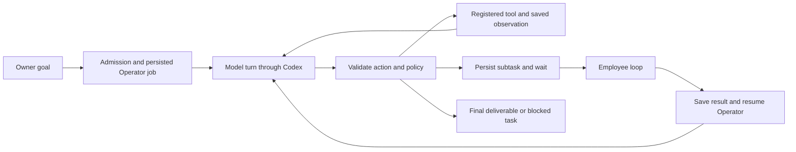

# In-house agent runtime

The app owns the agent loop and its durable state. The official Codex SDK provides subscription-authenticated model turns; it does not schedule the company or execute its tools. The runtime follows a lightweight agent pattern with tools, memory, delegation and observable sessions. It has no Hermes dependency.

## Responsibilities

- `model-tasks.ts`: owner request validation, idempotent admission, rolling daily task limit and a single active runner.
- `agent-runtime.ts`: durable assignments, model turns, delegation/return, context assembly, budgets, cancellation, recovery and events.
- `agent-protocol.ts`: strict structured response schema and action contracts.
- `agent-tools.ts`: application-owned tool execution against scoped data.
- `codex-provider.ts`: ChatGPT sign-in and the official SDK transport, with native tools disabled.
- `006_agent_runtime.sql`: jobs, memories, artifacts, events and turn observations. Earlier migrations and saved history remain unchanged.

Each model response supplies a short `message`, an `artifact` and exactly one typed `action`. Only validated actions can execute. A tool produces a persisted observation for the next turn. No model response is interpreted as executable code, a URL, a filesystem path or SQL.

## Actions and permissions

| Action | Effect | Scope |
| --- | --- | --- |
| `company.read` | Read virtual balances and team roles | Read only; no owner authentication data |
| `memory.read` / `memory.write` | Recall or update a saved fact | Current employee only; 16 keys, 2,000 characters each |
| `artifact.read` / `artifact.save` | Read or save a text deliverable | Current task only; cannot overwrite another employee's work; reserved completion names are protected |
| `delegate` | Create a child assignment and suspend the parent | Operator only, to Scout, Studio or Review; target must be enabled |
| `complete` | Save a result and return to the parent | Specialists return to Operator; Operator alone completes the owner's task |
| `blocked` | Stop with an explained obstacle | Preserves all prior results |

Operator begins as the sole queued job. Delegation atomically queues a child and puts Operator in `waiting`. A child completion saves its result and queues Operator again. Operator can answer a simple goal directly, delegate different work, or request a revision. Completing a task with Studio work requires a completed Review assignment created after the latest Studio assignment. This checks that an independent review occurred; it cannot prove that generated content is correct.

Tool permission denials become observations so an agent can correct its next action. Malformed/unknown actions stop the task before tool execution. Disabled employees, company pause and cancellation are checked again after model calls. Treasury has no model identity, delegation target or writable tool. There is no shell, browsing, publication, external messaging, payment or financial-mutation tool in this release.

## Context and persistence

Every turn receives the owner goal, assignment, the employee's recent memories, completed child results, a manifest of this task's artifacts and recent turn observations. Older context is removed as whole records to keep valid JSON. Oversized context stops before another call. Complete artifacts remain addressable through `artifact.read`. Context is assembled from SQLite; there is no reliance on an ephemeral Codex conversation surviving a restart.

Memory belongs to one employee and persists across tasks. Artifacts belong to one task. Both are untrusted data in subsequent prompts. The owner can view and clear memories in employee details; clearing is blocked while a task is active so its context remains consistent. Artifacts and memory are included in the existing SQLite backup. Codex authentication remains separately stored on the persistent volume.

Completed handoffs publish the model's actual message to the team board. Tool observations and assignment events appear under Agent activity. The animated office visualizes actual delegation/return handoffs; same-employee turns represent work at a desk. Historical tasks keep their original responses without invented jobs or memory.

## Limits and recovery

One instance and one active team task are supported, with 20 admitted tasks per rolling 24 hours. Each task allows 12 model calls, a ten-minute wall-clock deadline and a three-minute deadline per call. A 60,000 reported-token threshold stops further work. Usage is reported after the call, so an individual response can exceed the threshold; the response is saved and its action is withheld. Unknown tokens are explicitly unknown, while call and time limits still apply. These controls are separate from the virtual financial ledger and do not predict the account's remaining Codex allowance.

Model calls run outside synchronous SQLite transactions. A completed response is saved before its action; tool side effects and observations commit atomically. On restart, active work becomes interrupted/blocked, with no automatic replay of a model call or an unapplied action. Queued work that has never made a call can be scheduled normally. Owner cancellation is durable and idempotent, aborts an active call, and prevents late replies from executing tools. A provider may already have consumed usage before cancellation or interruption.

Provider transport errors are replaced with bounded operational explanations. A storage failure makes readiness fail. To continue a blocked task, review saved results and submit a new owner goal; there is no ambiguous retry button.

## Verification

Runtime tests cover adaptive one-turn completion, delegation/return, review enforcement, tool ownership, memory isolation and persistence, tool feedback, unknown actions, call/token limits, timeout, cancellation with a provider that ignores abort, queued cancellation, interruption recovery, duplicate admission and API permissions. Browser tests exercise delegation, memory creation and owner clearing, in-flight cancellation, saved deliverables, live office state and existing dashboard flows using a fixture model transport. Subscription transport still requires owner ChatGPT sign-in on the hosted server.
